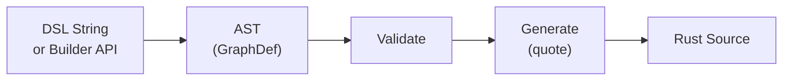

# Graph Codegen

Limen's code generation layer removes the boilerplate cost of a strongly-typed,
zero-dynamic-dispatch graph system. Developers describe their graph once; the
codegen produces fully type-safe Rust — a `no_std` graph and optionally a
`std` concurrent variant — from the same definition.

---

## Three Approaches

### 1. Proc-Macro (via `limen-build`)

Inline graph definition in source:

```rust
use limen_build::define_graph;

define_graph! {
    pub struct MyGraph;
    nodes {
        0: { ty: MySource, in_ports: 0, out_ports: 1,
             in_payload: (), out_payload: SensorData, name: Some("src") },
        1: { ty: MySink,   in_ports: 1, out_ports: 0,
             in_payload: SensorData, out_payload: (), name: Some("sink") },
    }
    edges {
        0: { ty: StaticRing<MessageToken, 8>, payload: SensorData,
             from: (0,0), to: (1,0), policy: MY_POLICY },
    }
}
```

Fast iteration. Adds to incremental build time.

### 2. Build-Script DSL

Graph definition in `build.rs` as a DSL string:

```rust
// build.rs
use limen_codegen::expand_str_to_file;
expand_str_to_file(DSL_STR, &out_path)?;

// In source:
include!(concat!(env!("OUT_DIR"), "/my_graph.rs"));
```

Explicit control. No incremental build overhead.

### 3. Typed Builder API

Programmatic graph construction in `build.rs`:

```rust
use limen_codegen::builder::{GraphBuilder, Node, Edge};

let ast = GraphBuilder::new(vis, name)
    .node(Node::new(0).ty::<MySource>().in_ports(0).out_ports(1)
        .in_payload::<()>().out_payload::<SensorData>())
    .edge(Edge::new(0).ty::<StaticRing<MessageToken, 8>>()
        .payload::<SensorData>().from(0, 0).to(1, 0))
    .finish();

limen_codegen::expand_ast_to_file(ast, &out_path)?;
```

Language-server-friendly. Strongly typed. No DSL parsing.

---

## Generation Pipeline



---

## DSL Validation Rules

1. Node indices must be contiguous `0..N`; edge indices contiguous `0..M`.
2. Edge endpoints must reference valid node port indices.
3. Edge payload type must match the connected nodes' in/out payload.
4. All inbound edges to a node share the same queue type; all outbound edges
   share the same queue type.
5. Ingress edges (synthetic, for source nodes only) must have the lowest
   global edge indices.

Validation errors are reported as `CodegenError::Validate` with a descriptive
message identifying the offending node/edge.

> **Current limitation:** All inbound edges to a node must share a single
> payload type, and all outbound edges must share a single payload type. This
> constraint is planned to be relaxed if possible in future versions (see
> C2 — N-to-M arity).

---

## Generated Items

For a graph `pub struct MyGraph`:

| Item | Description |
|---|---|
| `pub struct MyGraph` | Graph struct with typed node and edge tuples |
| `impl GraphApi<N, E>` | Descriptors, occupancy, stepping |
| `impl GraphNodeAccess<I>` | Per-node typed access (for each node) |
| `impl GraphEdgeAccess<E>` | Per-edge typed access (for each edge) |
| `impl GraphNodeTypes<I, IN, OUT>` | Payload, queue, and manager type association |
| `impl GraphNodeContextBuilder<I, IN, OUT>` | StepContext factory |

With `concurrent;` in the DSL (or `.concurrent(true)` in the builder), the
following items are generated **in addition to** the base `GraphApi`
implementation — the concurrent variant is an extension, not an alternative:

| Item | Description |
|---|---|
| `impl ScopedGraphApi<N, E>` | Concurrent execution via scoped threads |
| `enum OwnedBundle` | Safe per-node data bundle for thread handoff |

Both the base and concurrent items are available in the same generated file.
The concurrent items are gated behind `#[cfg(feature = "std")]`.

---

## Related

- [Graph Model](graph.md) — the traits that generated code implements
- [Edge Model](edge.md) — queue types used in graph definitions
- [Node Model](node.md) — node types used in graph definitions
