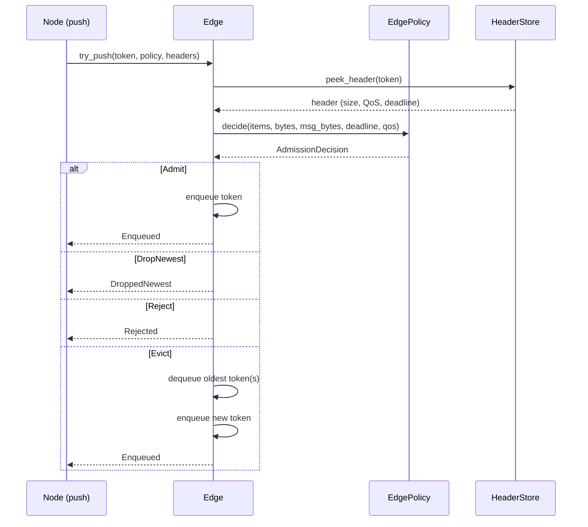

# Edge Model

Edges are typed, policy-enforced SPSC queues connecting node output ports to
node input ports. They store `MessageToken` handles — not full messages — and
use the `HeaderStore` supertrait of `MemoryManager` for admission and byte
accounting decisions. All dispatch is static; no `dyn Trait` in the hot path.

---

## Edge Trait

```rust
pub trait Edge {
    fn try_push<H: HeaderStore>(
        &mut self, token: MessageToken, policy: &EdgePolicy, headers: &H,
    ) -> EnqueueResult;

    fn try_pop<H: HeaderStore>(
        &mut self, headers: &H,
    ) -> Result<MessageToken, QueueError>;

    fn occupancy(&self, policy: &EdgePolicy) -> EdgeOccupancy;
    fn is_empty(&self) -> bool;
    fn try_peek(&self) -> Result<MessageToken, QueueError>;
    fn try_peek_at(&self, index: usize) -> Result<MessageToken, QueueError>;

    // Provided default implementations:
    fn peek_header<'h, H: HeaderStore>(
        &self, headers: &'h H,
    ) -> Result<H::HeaderGuard<'h>, QueueError>;

    fn try_pop_batch<H: HeaderStore>(
        &mut self, policy: &BatchingPolicy, headers: &H,
    ) -> Result<BatchView<'_, MessageToken>, QueueError>;

    fn get_admission_decision<H: HeaderStore>(
        &self, policy: &EdgePolicy, token: MessageToken, headers: &H,
    ) -> AdmissionDecision;
}
```

### EnqueueResult

```rust
pub enum EnqueueResult { Enqueued, DroppedNewest, Rejected }
```

### EdgeOccupancy

Point-in-time snapshot returned by `occupancy()`:

```rust
pub struct EdgeOccupancy {
    items: usize,
    bytes: usize,
    watermark: WatermarkState,
}
```

Used by runtimes for scheduling decisions and telemetry without querying the
full queue state.

---

## Admission Flow



---

## Implementations

| Implementation | Feature | Allocation | Notes |
|---|---|---|---|
| `StaticRing<N>` | *(default)* | Fixed-size, stack-allocated | Primary `no_std` queue |
| `HeapRing` | `alloc` | Heap-backed, bounded | Flexible capacity |
| `ConcurrentEdge` | `std` | `Arc<Mutex<Q>>` wrapper | For `ScopedGraphApi` |
| `Priority2<QHi, QLo>` | *(default)* | Composable | Two-lane QoS priority |
| `SpscAtomicRing` | `spsc_raw` | Lock-free atomic | **Incomplete stub.** Foundation for zero-lock concurrent edge (ADR-013). Will be updated or removed before release. |

### NoQueue

Placeholder `Edge` for unconnected/phantom ports. All push operations return
`Rejected`; all pop operations return `Empty`.

### Planned: Zero-Lock Concurrent Edge

A future `AtomicRing<N>` will provide lock-free, `no_alloc` SPSC queueing
using atomic head/tail pointers and raw pointers internally. This will allow
a single edge type to work in both single-threaded and multi-threaded
execution without `Arc` or `Mutex`. See
[ADR-013](../ADRs/013_ZERO_LOCK_ZERO_COPY_CONCURRENT_GRAPHS.md) for the full design.

---

## ScopedEdge (std)

Extension trait for concurrent graph execution:

```rust
pub trait ScopedEdge: Edge {
    type Handle<'a>: Edge + Send + 'a where Self: 'a;
    fn scoped_handle<'a>(&'a self, kind: EdgeHandleKind) -> Self::Handle<'a>;
}
```

`EdgeHandleKind` is `Producer` or `Consumer`. `ConcurrentEdge` implements
`ScopedEdge` by returning `Arc`-based handles safe for use across scoped threads.

---

## Conformance Test Suite

Any external `Edge` implementation can be validated against the built-in
contract test suite:

```rust
run_edge_contract_tests!(MyCustomQueue);
```

The macro exercises FIFO ordering, capacity limits, token coherence, occupancy
accuracy, and admission decision correctness.

---

## Related

- [Memory Model](memory_manager.md) — the `HeaderStore` used by edges
- [Policy Guide](policy.md) — `EdgePolicy` and admission rules
- [Node Model](node.md) — how nodes interact with edges via `StepContext`
