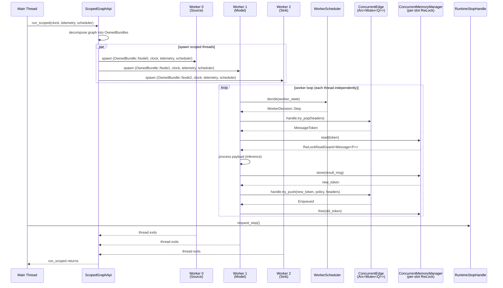

# Concurrent Graph Flow (std)

This document describes how a Limen graph executes with per-node worker threads
on Linux or server targets — the `std`-feature concurrent execution path using
`ScopedGraphApi`.

---

## Execution Flow



---

## Key Properties

### One Scoped Thread Per Node

`ScopedGraphApi::run_scoped()` uses `std::thread::scope` to spawn one thread
per node. Each thread receives an `OwnedBundle` containing all the state it
needs to step its node independently. When the scope exits, all threads are
joined automatically — no manual lifecycle management.

### OwnedBundle

A generated enum with one variant per node. Each variant contains:
- The node instance
- `ScopedEdge::Handle` references for all incident edges
- `ScopedManager` handles for all incident memory managers
- Clock and telemetry clones
- Edge and node policies

The bundle provides everything a worker needs to step its node without
accessing shared graph state.

### ConcurrentEdge

`ConcurrentEdge` wraps any `Edge` implementation in `Arc<Mutex<Q>>`. The
`ScopedEdge` trait produces `Handle` instances (producer or consumer) that
are `Send` and safe to use across scoped threads.

### ConcurrentMemoryManager

Per-slot `RwLock<Message<P>>` with a lock-free atomic freelist:
- **Reads on different tokens do not contend** — each slot has its own lock.
- **Store/free** uses an atomic CAS freelist — no global lock.
- `ReadGuard` resolves to `RwLockReadGuard<Message<P>>`.

### WorkerScheduler

Each worker thread calls `scheduler.decide(state)` before every step:

```rust
pub enum WorkerDecision {
    Step,               // Execute one step
    WaitMicros(u64),    // Sleep then re-evaluate
    Stop,               // Shut down this worker
}
```

This allows sophisticated scheduling strategies (e.g., sleep when inputs are
empty, rate-limit under thermal constraints) without modifying node code.

### RuntimeStopHandle

Cross-thread cooperative stop. `Clone`able `Arc<AtomicBool>`. The main thread
calls `request_stop()`; workers observe via `is_stopping()` and exit their
loops.

---

## Memory Layout

```
Heap (std)
├── ConcurrentEdge 0: Arc<Mutex<StaticRing<8>>>
├── ConcurrentEdge 1: Arc<Mutex<StaticRing<4>>>
├── ConcurrentMemoryManager 0
│   ├── slots: Vec<RwLock<Option<Message<P>>>>
│   └── freelist: AtomicUsize (lock-free stack)
└── ConcurrentMemoryManager 1
    ├── slots: Vec<RwLock<Option<Message<Q>>>>
    └── freelist: AtomicUsize

Thread stacks (one per node)
├── Worker 0: OwnedBundle::Node0 { source, edge handles, manager handles }
├── Worker 1: OwnedBundle::Node1 { model, edge handles, manager handles }
└── Worker 2: OwnedBundle::Node2 { sink, edge handles, manager handles }

Shared (Clone)
├── Clock (Clone + Send + Sync)
├── Telemetry (Clone + Send)
└── RuntimeStopHandle (Arc<AtomicBool>)
```

---

## Comparison with no_std Flow

| Aspect | no_std | Concurrent (std) |
|---|---|---|
| Threading | Single-threaded | One thread per node |
| Edge access | `&mut` borrow | `Arc<Mutex<Q>>` handle |
| Memory manager | Direct reference | Per-slot `RwLock` |
| Scheduling | `DequeuePolicy` (centralised) | `WorkerScheduler` (per-worker) |
| Allocation | Zero (stack only) | Heap (Arc, Vec, RwLock) |
| Stop mechanism | `is_stopping()` flag | `RuntimeStopHandle` (cross-thread) |
| Graph access | `&mut Graph` | `OwnedBundle` (decomposed) |

---

## Related

- [Runtime Model](runtime.md) — `ScopedGraphApi` and `WorkerScheduler`
- [Memory Model](memory_manager.md) — `ConcurrentMemoryManager` details
- [Edge Model](edge.md) — `ScopedEdge` and `ConcurrentEdge`
- [no_std Graph Flow](graph_flow_no_std.md) — the single-threaded alternative
