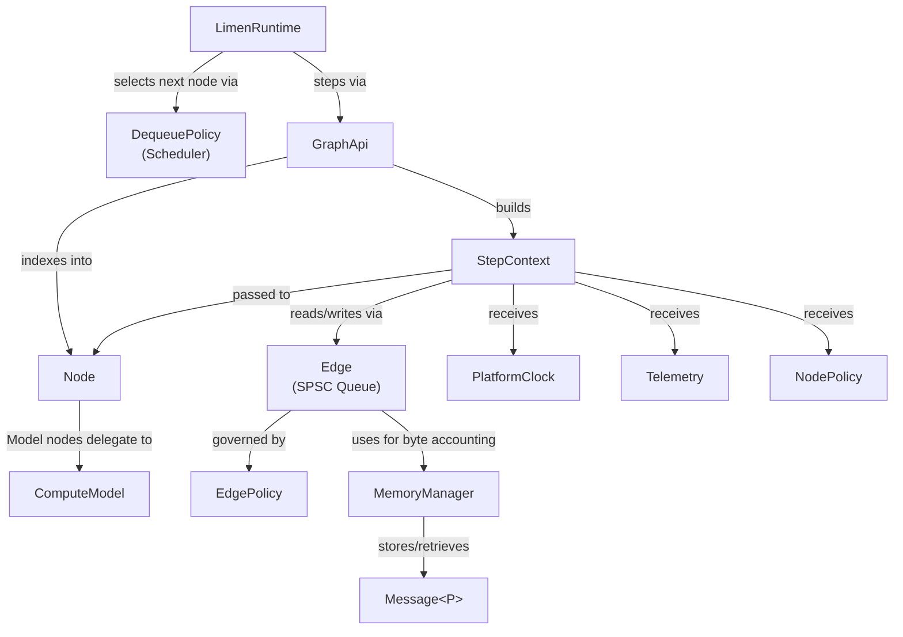
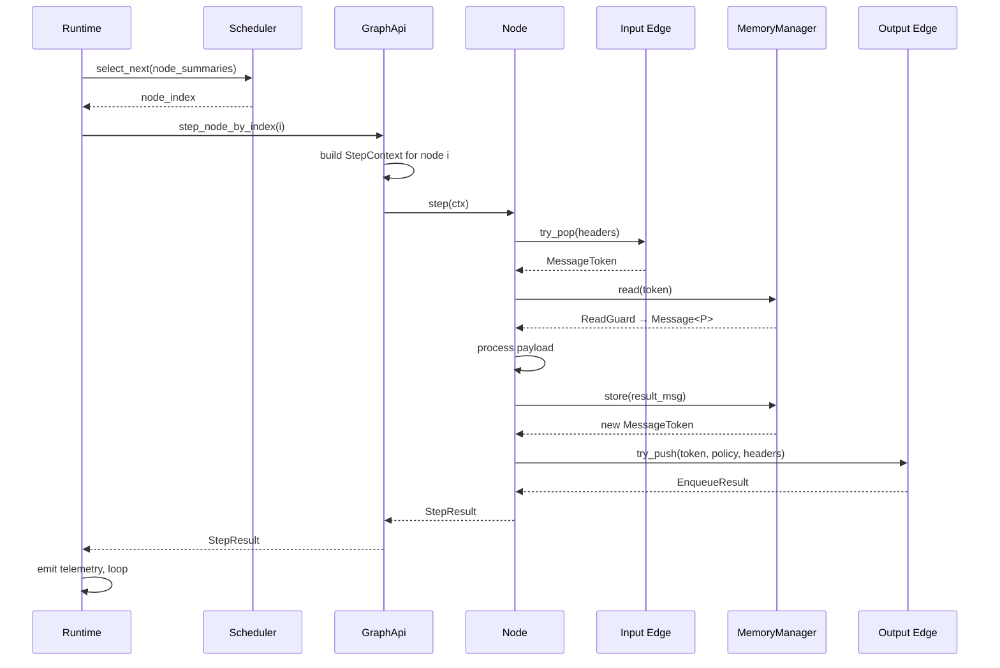

# Limen Architecture

This guide covers the system design of Limen — a graph-driven, edge inference
runtime for embedded systems. Limen's architecture is built around a small
number of composable contracts that compile to zero-overhead code on any target.

---

## Design Philosophy

**Core defines contracts and provides reference implementations.** `limen-core`
owns all traits and types, and also provides reference edge implementations
(`StaticRing`, `HeapRing`, `ConcurrentEdge`) and memory managers
(`StaticMemoryManager`, `HeapMemoryManager`, `ConcurrentMemoryManager`).
Runtimes, platforms, and inference backends are all downstream of core and can
evolve independently.

**Monomorphization over dynamic dispatch.** Every node, edge, queue, clock,
and telemetry sink is a concrete generic type in the hot path. No vtables, no
heap allocation required. This is a deliberate choice for MCU targets where
vtable dispatch is unacceptable.

**Feature flags as a first-class concern.** The same source file compiles
correctly under `no_std`, `alloc`, and `std`. This is not an afterthought — it
is enforced by the CI matrix.

**Contracts are enforced, not just observed.** Freshness, liveness, and
criticality are not metrics emitted after the fact. They are policies checked
at the scheduling boundary. A message that has expired should not reach a node.

**Codegen removes the abstraction tax.** The ergonomic cost of a strongly-typed,
zero-dynamic-dispatch system is usually a wall of type parameters. Codegen pays
that cost once, at build time, so application developers never see it.

---

## System Overview



### Data Flow (One Step)



---

## Workspace Structure

```
limen/
├── limen-core        ← base contracts, no_std-first
│   ├── limen-node    ← concrete node implementations
│   ├── limen-runtime ← graph executors and schedulers
│   ├── limen-platform← platform adapters (clock, affinity)
│   └── limen-codegen ← DSL → Rust code generator
│         └── limen-build ← proc-macro wrapper for codegen
└── limen-examples    ← integration tests
```

| Crate | Depends On | Role |
|---|---|---|
| `limen-core` | — | Traits, types, edge implementations, memory managers, nodes, graph API, policies, telemetry |
| `limen-node` | `limen-core` | Concrete node implementations |
| `limen-runtime` | `limen-core` | Executors and schedulers |
| `limen-platform` | `limen-core` | Platform adapters (clocks, I/O) |
| `limen-codegen` | `limen-core` | Graph builder and Rust code generator |
| `limen-build` | `limen-codegen` | Proc-macro wrapper |
| `limen-examples` | all | Integration tests and examples |

---

## Feature Flag Hierarchy

Feature flags are **additive** — `std` implies `alloc`, `alloc` implies nothing
about `std`. All crates share the same hierarchy:

| Flag | What it unlocks |
|---|---|
| *(default)* | `no_std`, no heap. Fixed-size SPSC queues, static memory managers. |
| `alloc` | Heap-backed queues (`HeapRing`), `Vec`-based batch paths, `HeapMemoryManager`. |
| `std` | Implies `alloc`. Concurrent queues, `ConcurrentMemoryManager`, `ScopedGraphApi`, threaded runtimes, I/O telemetry sinks. |
| `spsc_raw` | Unsafe lock-free ring buffer (requires `std`). |
| `bench` | Exposes test nodes, queues, and runtime implementations for integration tests. |

**Planned:** A future `no_alloc` lock-free concurrent edge and memory manager
option is planned, using raw pointers internally to provide true zero-lock
concurrency without `Arc` or `Mutex`. This will allow a single graph definition
to run on both bare-metal single-threaded and multi-threaded runtimes without
changing edge or memory manager types. See
[ADR-013](../ADRs/013_ZERO_LOCK_ZERO_COPY_CONCURRENT_GRAPHS.md) for details.

---

## Module Map

| Document | Covers |
|---|---|
| [Message and Payload](message_payload.md) | Message envelope, headers, payload trait, tensors, batches |
| [Memory Model](memory_manager.md) | Token-based zero-copy storage, guard API, memory classes |
| [Edge Model](edge.md) | SPSC queue contract, implementations, admission flow |
| [Node Model](node.md) | Uniform processing contract, StepContext, step lifecycle |
| [Source Nodes](source.md) | Sensor/ingress adapter, ingress edge |
| [Sink Nodes](sink.md) | Output adapter, input selection |
| [Inference Nodes](model.md) | ComputeBackend, ComputeModel, InferenceModel adapter |
| [Graph Model](graph.md) | Compile-time typed topology, GraphApi, ScopedGraphApi |
| [Runtime Model](runtime.md) | Executor contract, runtime tiers, scheduling |
| [Telemetry](telemetry.md) | Zero-cost metrics, structured events, aggregation |
| [Platform](platform.md) | Clock abstraction, platform boundary |
| [Policy Guide](policy.md) | Admission, batching, deadline, and budget policies |
| [Graph Codegen](codegen.md) | Three graph definition approaches, DSL, validation |

### Execution Flow Diagrams

| Document | Covers |
|---|---|
| [no_std Graph Flow](graph_flow_no_std.md) | Single-threaded execution on bare-metal targets |
| [Concurrent Graph Flow](graph_flow_concurrent.md) | Multi-threaded execution with scoped worker threads |
