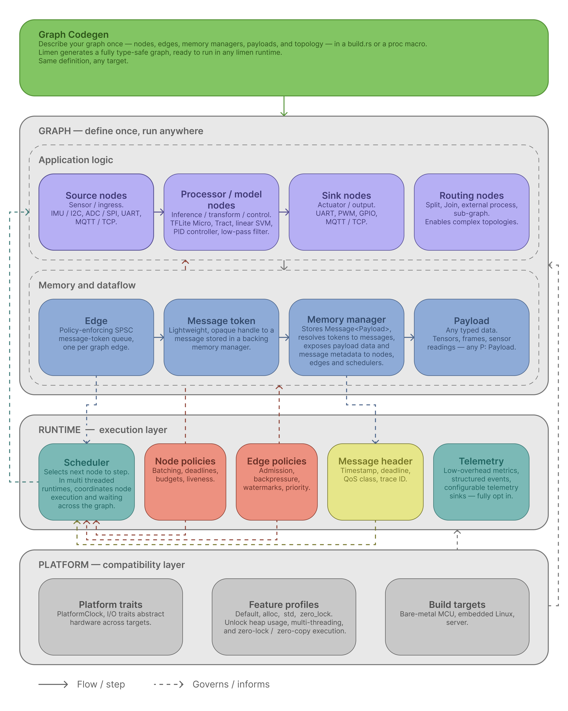

# Limen
## A Portable Execution Framework for Real-Time, Resource-Constrained AI Systems

**Author:** Arlo Louis Byrne  
**Organisation:** Umbriel Systems  

---

## 1. Abstract

AI systems are increasingly deployed in environments where computation must operate continuously under strict latency and resource constraints. These systems — ranging from industrial monitoring pipelines to robotics and embedded inference — require predictable execution, explicit control over memory and data validity, and portability across heterogeneous hardware targets.

Most widely used machine learning frameworks primarily optimise model execution rather than whole-system construction for continuous, resource-constrained, real-time environments. They typically assume server-class hardware, dynamic memory allocation, and runtime dispatch. As a result, engineers building real-world AI systems must repeatedly reimplement infrastructure across platforms, sacrificing reliability and efficiency.

Limen introduces a different approach: a compile-time defined computation graph framework where execution constraints — freshness, deadlines, admission control, liveness, and criticality — are part of the system definition itself, not external operational concerns layered on after the fact. Systems are defined as directed graphs of typed nodes connected by lock-free queues, with explicit memory management and configurable policies governing data flow, scheduling, and execution validity. These graphs compile into static Rust code with all types resolved at compile time, and are designed to preserve the same system definition across compatible targets, from bare-metal microcontrollers to multi-threaded servers.

Limen aims to make real-time, resource-constrained, AI-enabled systems easier to build consistently across embedded, edge, and server-class environments.

---

## 2. Introduction

The deployment of AI systems has shifted beyond cloud infrastructure into real-world environments: embedded microcontrollers, edge devices, robotics systems, and industrial monitoring infrastructure. In these contexts, systems must process continuous streams of data, meet strict latency requirements, operate within constrained compute and memory budgets, and function reliably without external connectivity.

Despite this shift, the dominant AI tooling ecosystem remains oriented around server-based workloads. Frameworks such as PyTorch, ONNX Runtime, and TensorFlow Lite are highly effective at executing models, but they do not provide a complete system-level framework for the environments where AI increasingly needs to operate.

Building a real-world AI system requires far more than inference. Data must be ingested, transformed, and routed. Execution must be scheduled under timing constraints. Memory must be managed within fixed budgets. Failures must be handled according to the criticality of each processing path. These concerns are typically addressed through custom, platform-specific implementations that are difficult to reuse, test, or reason about.

The result is fragmentation: identical system logic is rewritten for each target, behaviour varies across deployments, and system-level validity constraints are difficult to enforce consistently.

Limen is designed to address this problem by providing a unified framework for defining and executing AI-enabled systems across environments — one where the constraints that determine whether a system is operating within its defined conditions are expressed alongside the computation itself, not managed externally.

---

## 3. Core Thesis

Limen's central idea is that execution constraints — such as data freshness, scheduling deadlines, admission control, liveness guarantees, and failure criticality — should be part of the system model itself, not external operational concerns layered on after the fact.

In most existing approaches, these concerns are handled through logging, monitoring, ad hoc runtime logic, or simply left to the judgement of operators. The system definition describes what computation happens, but not the conditions under which it should be considered valid, timely, or safe.

Limen proposes that these conditions belong in the system definition alongside data flow and computation. When a system specifies that input data must be fresh within a time window, that a processing node must execute at a minimum rate, or that a safety-critical path must halt rather than degrade — these are not monitoring concerns. They are execution semantics.

By making these constraints explicit and enforceable, Limen aims to produce systems that are easier to reason about, more consistent across deployments, and more reliable under real-world operating conditions.

---

## 4. Problem

### 4.1 Execution Validity Is Not Part of the System Model

In real-world systems, validity depends on properties that extend well beyond whether the right function was called with the right types. It depends on whether input data is still fresh, whether components are actively progressing, how failures are handled across paths of different importance, and how data flow is regulated under load.

Existing frameworks do not model these properties as part of the system definition. Instead, they are treated as external concerns—implemented through logging, monitoring dashboards, or ad hoc runtime checks. The result is systems where validity is observed and reacted to rather than defined and enforced, making them fragile under real-world conditions and difficult to reason about across deployments.

### 4.2 System Infrastructure Is Reimplemented Repeatedly

A typical AI-enabled system pipeline — sensor -> pre-processing -> inference -> post-processing -> output — must be implemented separately for microcontroller firmware, embedded applications, and server-side systems. Despite identical logical structure, implementations diverge significantly across targets. This leads to duplicated engineering effort, inconsistent behaviour, and increased maintenance complexity, with each platform accumulating its own set of assumptions and failure modes.

### 4.3 Existing Infrastructure Is Not Designed for Constrained Environments

Most AI frameworks assume dynamic memory allocation, runtime dispatch, and server-class hardware. These assumptions introduce unpredictable latency, inefficient resource usage, and fundamental incompatibility with bare-metal and embedded environments. Deploying AI systems in constrained environments requires substantial reengineering — not because the system logic differs, but because the infrastructure assumes capabilities that are not available.

---

## 5. What Limen Is

Limen is a compile-time graph-based execution framework for building portable, real-time AI-enabled systems with explicit execution semantics and operational constraints.

More concretely, Limen is a framework for defining AI-enabled systems as typed computation graphs in which execution constraints are part of the system definition, the resulting system compiles into efficient static code, and the same structural definition is intended to be preserved across compatible targets. Actual executability still depends on the availability of the required backends, platform features, and memory regions.

Limen operates at the system level. It is concerned not just with executing inference, but with the complete pipeline surrounding it: data ingestion, transformation, routing, scheduling, memory management, timing constraints, failure handling, and observability. It integrates existing inference runtimes rather than replacing them.

A Limen system consists of:

- **Nodes** — units of computation with typed input and output ports
- **Edges** — lock-free queues connecting node ports, carrying lightweight tokens rather than payload data
- **Memory managers** — typed storage backends that own message data, decoupled from queue management
- **Policies** — constraints governing admission, scheduling, data validity, and execution

These components are defined at compile time and transformed into static Rust code via code generation. The resulting system is designed around static dispatch, fixed-capacity data structures, and explicit resource ownership, making it suitable for environments where dynamic allocation and runtime dispatch are not acceptable.

---

## 6. Design Principles

Limen is built around a set of design principles that guide architectural decisions throughout the framework.

**System-level semantics over ad hoc orchestration.** Execution constraints and data flow policies are declared alongside the computation itself, not implemented through external tooling or custom runtime logic.

**Compile-time structure where feasible.** Graph topology, type parameters, node and edge counts, and policy configurations are resolved at compile time. This eliminates runtime graph construction overhead and enables the compiler to verify structural invariants before execution.

**Explicit resource ownership.** Memory management is not implicit or garbage-collected. Each memory region is explicitly owned, and data flow through the system follows a clear ownership model based on typed tokens and placement-aware storage.

**Stable system structure across heterogeneous targets.** A single system definition is designed to preserve its structure and semantics across hardware targets. Platform-specific concerns are isolated behind minimal abstraction interfaces, and the core execution model does not assume operating system services.

**Constrained-runtime compatibility.** The framework is designed for environments without heap allocation, dynamic dispatch, or operating system support. Features requiring these capabilities are available through additive configuration but are never required by the core execution path.

**Execution visibility without runtime tax.** Telemetry is integrated into the execution model as a first-class concern. When telemetry is not needed, it is designed to compile out entirely, imposing no cost on constrained deployments where every cycle matters.

---

## 7. Architecture

  
   
  <em>Figure 1. Limen system architecture. (Click to view full resolution)</em>

### 7.1 Compile-Time Graph Construction

Limen systems are defined declaratively and compiled into concrete, fully typed implementations. Graph definitions specify node types, port counts, payload types, directed connections between node ports, edge configurations, policies, and memory manager assignments.

Code generation produces monomorphized Rust code with all type parameters resolved at compile time. Structural invariants such as port compatibility and graph consistency are validated during code generation, so invalid graph definitions fail before execution.

### 7.2 Node Model

Nodes are the fundamental units of computation. Each node defines its input and output port counts and payload types at compile time. Nodes are purely synchronous: the runtime calls a step function, which receives a context providing access to input and output queues, memory managers, the platform clock, and telemetry — all through static dispatch.

Nodes are classified by kind: sources (data ingestion), processors (transformation), models (bound to a compute backend for inference), splits (fan-out), joins (fan-in), and sinks (terminal consumption). Each step returns a result that directly informs scheduling decisions. Nodes support both single-message and batch processing, with configurable batching policies.

### 7.3 Edge Model

Edges are single-producer, single-consumer (SPSC) queues that connect one output port of a node to one input port of another. SPSC is an intentional design choice: it simplifies reasoning about data ownership and enables lock-free implementations with minimal coordination overhead. Fan-out and fan-in topologies are expressed through dedicated node kinds rather than through multi-producer or multi-consumer queues.

Edges store tokens, not messages. Each edge operates on lightweight token handles, while the actual typed message data resides in a separate memory manager. This separation enables zero-copy data paths where placement is compatible, decouples queue implementation from payload storage, and allows header-only admission decisions without accessing payload data.

The edge implementation is designed around lock-free atomic operations over fixed-size storage, requiring no heap allocation and no locks. The same edge type is intended to work across single-threaded, multi-core bare-metal, and multi-threaded server execution without requiring different queue types per target. Edges additionally support priority queuing, where messages of different urgency levels are separated into independent lanes with priority-ordered dequeuing.

### 7.4 Memory Model

Memory management in Limen is explicit and decoupled from both nodes and edges.

Each edge is paired with a memory manager that owns typed message storage. The manager provides token-based access: producers store a message and receive a token; consumers redeem tokens to access message data. Like edges, memory managers are designed to be lock-free, using atomic per-slot state transitions rather than locks, enabling concurrent access without heap allocation.

This design supports zero-copy processing where producer, consumer, and memory placement requirements are compatible. Nodes can mutate payload data in place within the manager's storage, eliminating store-and-free overhead for in-place transformations. When memory placement is incompatible between producer and consumer, the runtime inserts an adaptation step.

Memory placement is classified by region — host memory, pinned (DMA-capable) host memory, device memory (GPU/NPU), or shared memory accessible by multiple devices. Nodes declare which memory regions they can accept. Placement compatibility is resolved at graph construction time, making the zero-copy or adaptation decision explicit and predictable rather than a runtime surprise.

### 7.5 Message Model

Every value in a Limen graph is a message consisting of a fixed header and a generic typed payload. The header carries structured metadata that drives admission, scheduling, and telemetry — including trace identifiers, sequence numbers, monotonic timestamps, optional deadlines, urgency and quality-of-service classification, freshness constraints, criticality classification, and memory placement. This metadata enables time-aware scheduling, deadline-driven admission, freshness enforcement, and urgency-based ordering without requiring payload inspection.

### 7.6 Policy Model

Policies are the mechanism by which execution constraints are expressed and enforced within the graph definition. They are configured per-edge and per-node at definition time and represent one of Limen's most distinctive architectural features.

Edge policies control data flow. Capacity policies define hard and soft limits on queue depth, establishing watermark thresholds that drive backpressure. Admission policies determine what happens when an edge is at or above capacity: drop newest, drop oldest, block, or apply deadline- and quality-of-service-aware selection. Over-budget actions define what happens when a node exceeds its time budget.

Node policies control execution: batching (fixed-count, time-window, or combined), budgets (soft per-step limits and hard watchdog timeouts), deadlines (required, with acceptable slack and default synthesis), freshness (maximum input age, with stale data dropped or flagged), liveness (minimum execution rate guarantees), and criticality (distinguishing safety-critical paths that must halt on failure from best-effort paths that may degrade gracefully).

Watermark states propagate backpressure through the graph. When an output queue approaches capacity, the runtime can defer execution of upstream nodes, allowing downstream consumers to drain before more data is produced.

### 7.7 Scheduling

Scheduling in Limen is a first-class concern with pluggable policies. The runtime computes a readiness state for each node based on input occupancy and output watermarks, then passes a summary of readiness, deadline, urgency, and backpressure state to a scheduling policy that selects the next node to execute.

Strategies include earliest-deadline-first, throughput-optimised selection, and urgency-aware scheduling that incorporates criticality to prioritise safety-critical paths. For concurrent execution, per-worker scheduling decisions enable multi-core runtimes where nodes run on dedicated cores with independent scheduling.

### 7.8 Runtime Model

The runtime executes the compiled graph through a uniform interface. Its lifecycle consists of initialisation, stepping (one scheduling round), continuous execution (looping until quiescence or stop), and reset for reuse.

Because edges and memory managers are designed to be lock-free and to avoid heap allocation, the same graph is intended to execute on single-threaded runtimes for bare-metal targets, multi-core bare-metal runtimes with lock-free cross-core communication and no operating system, and multi-threaded runtimes on server and desktop targets. The transition between execution models is designed to require no changes to the graph definition or node implementations — only the runtime varies.

Limen is designed to make execution order predictable and reproducible under a fixed scheduling policy. The strongest determinism properties apply in single-threaded execution; concurrent runtimes preserve the same graph semantics while relaxing strict execution ordering.

### 7.9 Telemetry

Telemetry is integrated as a first-class system primitive. The telemetry interface provides counters, gauges, latency recording, and structured event emission — including per-step timing, deadline misses, budget overruns, queue occupancy snapshots, and liveness violations. When telemetry is disabled, the compiler is designed to eliminate all collection code from the binary entirely. Aggregated metrics use fixed-buffer accumulation, compatible with bare-metal targets that have no heap.

### 7.10 Compute Backend Integration

Limen integrates existing inference runtimes rather than replacing them. Inference is modelled through two interfaces: a compute backend (a factory that reports capabilities and loads models) and a compute model (the inference interface itself, providing single-input and batch entry points on typed payloads). Both use static dispatch. Inference nodes participate in the graph like any other node, inheriting scheduling, admission, backpressure, and telemetry integration.

Model metadata describes memory placement preferences, enabling the runtime to make zero-copy decisions when placement is compatible with upstream producers.

Limen's portability applies to the system definition and execution framework; backend bindings and platform capabilities remain target-dependent. A graph referencing a specific compute backend can only execute on targets where that backend is available.

---

## 8. Key Properties

Limen is designed to provide the following properties:

- **Portability** — a single system definition is designed to compile and execute across hardware targets from bare-metal microcontrollers to multi-threaded servers, preserving structure and semantics across compatible targets
- **Predictable execution** — static dispatch and compile-time type resolution, designed for reproducible scheduling under fixed policies
- **Lock-free, zero-copy execution** — lock-free edges and memory managers are designed to enable concurrent execution without locks; zero-copy data paths are available where memory placement is compatible
- **Explicitness** — memory management, data flow, admission control, scheduling, freshness, liveness, and criticality are all declared within the graph definition
- **Composability** — reusable nodes with typed ports, modular graphs, and pluggable scheduling and admission policies
- **Safety** — implemented primarily in safe Rust, with unsafe code intended to be minimal, isolated, and auditable
- **Observability** — telemetry designed to compile out completely when disabled, avoiding runtime overhead in constrained deployments

---

## 9. What Limen Is Not

Limen occupies a specific position in the AI systems landscape, and it is important to be clear about what it does not attempt.

**Limen is not a model training framework.** It does not address model development, dataset management, or training infrastructure. It operates entirely in the deployment and execution domain.

**Limen is not a replacement for existing inference backends.** It integrates inference runtimes such as TensorFlow Lite Micro or Tract as compute backends within its graph model. Limen provides the system around inference, not the inference itself.

**Limen is not a general distributed data processing engine.** It is designed for local, on-device execution pipelines. While its portability model enables the same system to run on different targets, it does not provide distributed coordination, network transport, or cluster management.

**Limen is not primarily a cloud-serving platform.** Its design priorities — fixed-capacity data structures, no heap allocation in the core path, bare-metal compatibility — are oriented toward constrained and edge environments. It can execute on server hardware, but it is not optimised for the request-response serving patterns that characterise cloud inference.

---

## 10. Practical Boundaries

Several of Limen's architectural properties are conditional rather than universal, and it is important to state these conditions clearly.

**Portability depends on backend and platform support.** The system definition and execution framework are portable. However, a graph that references a specific compute backend or platform capability can only execute on targets where those dependencies are available. Portability is a property of the framework's execution model, not an unconditional guarantee about arbitrary system configurations.

**Zero-copy depends on compatible memory placement.** When producer and consumer nodes agree on memory region, data flows without copying. When they disagree, the runtime inserts an adaptation step. Zero-copy is a design goal that the framework maximises, not a universal property of all data paths.

**Determinism is strongest under controlled conditions.** Single-threaded execution under a fixed scheduling policy produces deterministic execution order. Concurrent runtimes preserve the same graph semantics and scheduling logic, but relaxing execution ordering means that strict step-for-step determinism is not guaranteed across concurrent configurations.

**Hard real-time guarantees are platform-dependent.** Limen provides the scheduling policies, deadline enforcement, and budget mechanisms needed to support real-time execution, but hard real-time guarantees ultimately depend on the underlying hardware and platform capabilities, not solely on the framework.

---

## 11. Use Cases

### Industrial Monitoring

An industrial anomaly detection system ingests continuous streams from vibration sensors, temperature probes, and pressure transducers. Each sensor produces data at different rates, and the inference model must receive inputs that are fresh — a vibration reading from thirty seconds ago is operationally meaningless for real-time fault detection. The system runs on local hardware at the plant, with no guarantee of cloud connectivity.

Limen allows such a system to define freshness constraints on each sensor input, so stale readings are dropped before they reach the model. Admission policies manage data flow when sensor bursts exceed processing capacity. Liveness policies ensure the inference node executes at a minimum rate, with violations surfaced through telemetry rather than discovered through downstream silence. The same pipeline definition can target the monitoring hardware directly, without reimplementation for each deployment environment.

### Robotics

A mobile robot runs a perception pipeline (camera frames and IMU data), a navigation model, and a motor control loop. These paths have fundamentally different timing requirements. A dropped camera frame is tolerable — the next frame arrives in milliseconds. A missed control loop deadline can cause the robot to overshoot a position or fail to brake. The perception pipeline is best-effort; the control loop is safety-critical.

Limen's criticality classification and urgency-aware scheduling are designed to express these mixed-criticality requirements directly in the graph definition. The control loop is marked as safety-critical with a hard deadline; the perception path is marked as best-effort with freshness constraints that allow stale frames to be discarded. The lock-free execution model is intended to enable concurrent operation on multi-core embedded hardware without requiring an operating system, with scheduling policies that ensure the control path takes priority when both paths contend for execution time.

### Embedded AI Systems

A microcontroller-based sensor node runs a lightweight classification model on audio data to detect specific acoustic events. The device has no operating system, a fixed memory budget, and must operate for months on battery power. Every allocation, every branch, every unnecessary computation has a cost.

Limen's design around fixed-capacity data structures, compile-time graph construction, and explicit memory management is intended to make these environments first-class targets. The system is defined once, compiled into a form with runtime indirection and dynamic infrastructure overhead removed from the core execution path, and executes within a predictable, bounded resource envelope rather than requiring substantial reengineering from a server-oriented baseline.

---

## 12. Vision

Limen is designed as a foundational layer for systems where computation is continuous, intelligence operates locally, and execution must be predictable and remain within defined operational constraints.

The broader ambition is to enable classes of systems that existing infrastructure does not natively model or enforce as integrated concerns — systems where the constraints governing valid execution are as much a part of the design as the data flow itself. Today, building such systems means assembling bespoke infrastructure for each target, each criticality requirement, and each deployment environment. The engineering cost of this fragmentation compounds with every platform, every revision, and every new constraint.

Limen's architectural thesis is that this cost can be substantially reduced by treating execution constraints, resource ownership, and system structure as a unified, portable definition. Autonomous systems with mixed-criticality workloads — where safety-critical control loops and best-effort perception pipelines coexist — should not require separate, hand-coordinated infrastructure for each path. Multi-core embedded robotics should not require an operating system to achieve concurrent execution with deadline-aware scheduling. Edge deployments across heterogeneous hardware should not require reimplementation of system logic that is structurally identical.

These are the classes of systems Limen is designed to serve: real-time, resource-constrained, AI-enabled systems that demand predictable execution, explicit resource control, and enforceable operational constraints — built once, and preserved across the targets where they need to run.

---

## 13. Conclusion

The deployment of AI systems in real-world environments requires capabilities that current infrastructure does not natively provide: portability across hardware targets, predictable execution under resource constraints, and enforceable execution semantics declared alongside the computation rather than managed as external operational concerns.

Limen addresses these challenges through compile-time graph definition, lock-free memory management designed for zero-copy data paths, and policy-driven execution with freshness, liveness, and criticality enforcement — backed by telemetry designed to compile out when disabled.

Real-time, resource-constrained, AI-enabled systems are today built as collections of platform-specific engineering compromises. Limen is an attempt to make them a first-class software engineering problem: a framework in which the system definition carries not just what computation happens, but the conditions under which that computation remains valid, timely, and safe.
